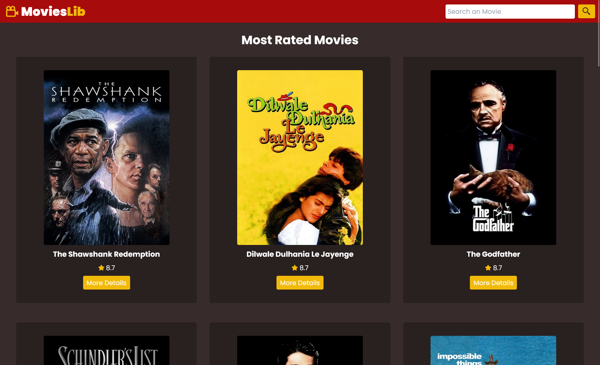

# MoviesLib

> Um projeto simples, que consome a API do The Movie Database, e retorna uma busca de filmes.

### 🚀 Ajustes e melhorias

O projeto ainda está em desenvolvimento e as próximas atualizações serão voltadas nas seguintes tarefas:

- [x] Layout e Estruturação
- [x] Funcionalidades
- [ ] Responsividade
